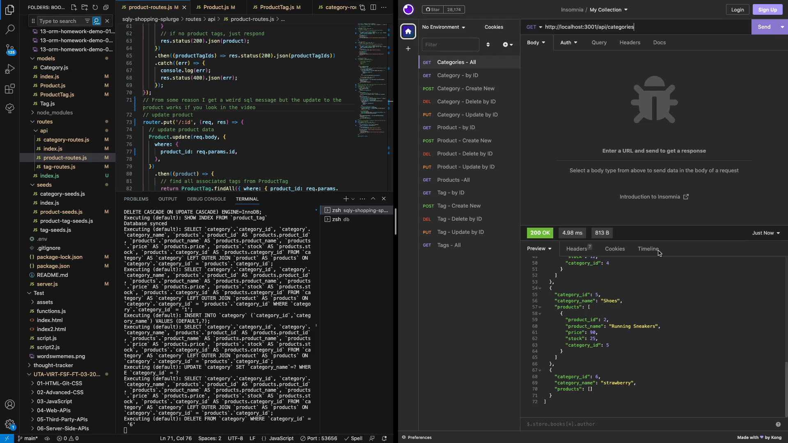

# Sqly Shopping Splurge

## Description

Sqly Shopping Splure(SSS) is a back-end application for an e-commerce website built using the latest technologies. The application utilizes Express.js and Sequelize to interact with a MySQL database. It provides a set of API routes to perform CRUD operations on categories, products, and tags. The application follows the MVC (Model-View-Controller) architectural pattern, where the models define the database structure, the controllers handle the route logic, and the views are represented as JSON responses.

## Features:

 - Connection to a MySQL database using Sequelize
 - Creation of a development database and seeding with initial or test data
 - Starting the server and syncing Sequelize models with the database
 - API routes for retrieving categories, products, and tags in JSON format
 - API routes for creating, updating, and deleting data in the database

## Installation:

This application utilizes Insomnia or a program like insomnia to view, update, and delete data from a database. After launching insomnia select the desired HTTP method (GET,POST,PUT,DELETE) and enter the endpoint URL, making sure it corresponds to the API route that retrieves, updates, or deletes data from the database.

## Credits: 
Stack Overflow
Academind https://www.youtube.com/watch?v=0Hu27PoloYw
PedroTech https://www.youtube.com/watch?v=0Hu27PoloYw
Dave Gray https://www.youtube.com/watch?v=Zh7psmf1KAA
freecodecamp.org - https://www.freecodecamp.org/news/http-request-methods-explained/

## License:

## Contact:

If you would like additional information, please contact Yevette Hunt.
My GitHub username is yveivy

## Demo Video: 

To see the functionality of the e-commerce back-end, please watch the following walkthrough video:

https://drive.google.com/file/d/1izsn86LdbE0Fi9l37hpLmJkeG6e2GOFl/view
